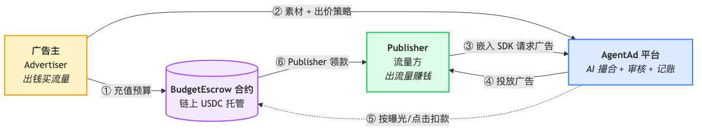
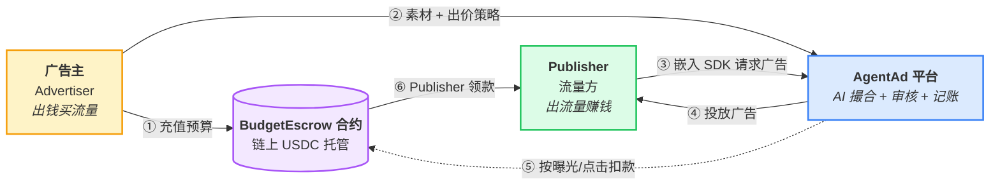
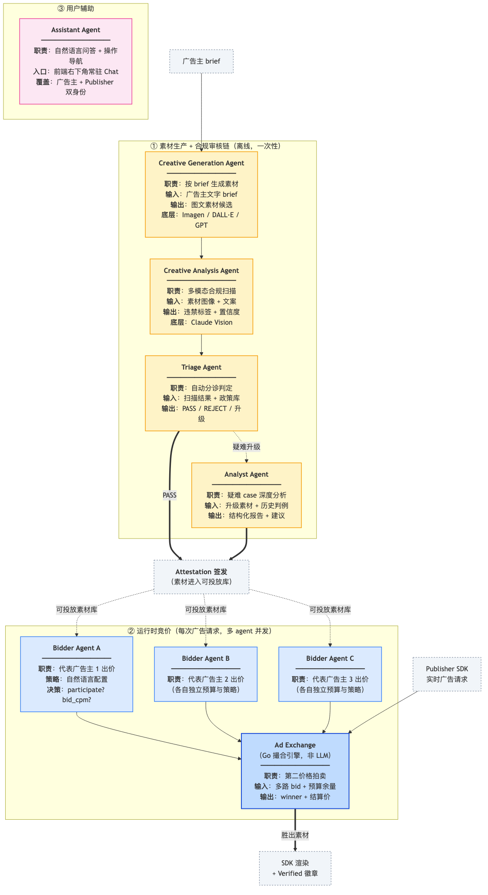
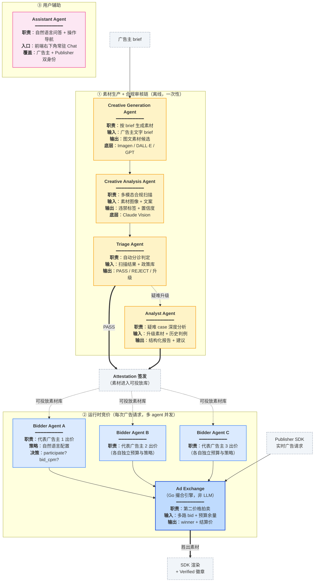

# AgentAd POC 演示稿 — 10 分钟

> 目标:在 10 分钟内让观众理解 **「AI 原生 + 可审计」的广告交易平台**,并看到真实竞价、展示、结算三段流程跑通。
>
> **建议节奏**
> - 0:00–0:45 开场问题
> - 0:45–2:30 两张架构图讲清楚(业务角色 + AI agent)
> - 2:30–7:30 Live 演示:竞价 → 展示 → 点击 → 结算
> - 7:30–9:00 信任层:Verified 徽章 + 链上 attestation + 未来 ZK 结算
> - 9:00–10:00 Roadmap & Q&A

---

## 0:00–0:45  开场(问题陈述)

> "传统的 programmatic 广告存在三个痼疾:
>
> 1. **竞价黑箱** —— 广告主把预算投进 DSP,看不到出价逻辑,出价决策是硬编码规则或离线训练的模型,不能按业务目标灵活调整。
> 2. **手动运营** —— 素材上传、合规审查、预算调拨、数据对账,都还是人工 + 工单。
> 3. **跨角色信任薄弱** —— Publisher 要相信平台给的曝光数据;广告主要相信平台没重复计费。审计靠 log 文件。
>
> 我们做的 AgentAd 把这三件事一次性换成:**每个环节由一个专职 AI agent 负责,关键数据以签名 + 链上 attestation + 未来的 ZK proof 三层背书。** 下面 10 分钟带大家跑一遍。"

---

## 0:45–1:30  图 1:业务角色关系

**展示下面这张图,然后照着讲 30 秒。** 导出版本见 `docs/diagrams/business-roles.png`。





> "整张图只有 **三个角色 + 一个托管合约**,按编号顺着看:
>
> ① 广告主先把预算以 USDC 存入链上 **BudgetEscrow**——钱从第一秒起就不在平台手上;
> ② 广告主把素材和出价策略交给 **AgentAd 平台**;
> ③ Publisher 在自家网页嵌入 SDK,每次有广告位就向平台请求广告;
> ④ 平台跑完拍卖后把胜出的广告渲染给 Publisher;
> ⑤ 每一次曝光和点击,平台只是向托管合约发一笔扣款指令,**自己不过钱**;
> ⑥ Publisher 累计到一定金额后,凭平台签的 receipt 直接从合约里 claim USDC。
>
> 一句话:**钱始终在合约里,平台只负责撮合和记账,不做资金托管方。**"

### 业务角色职责表

| 角色 | 在业务中的位置 | 主要动作 | 盈亏方向 | 对应模块 / 页面 |
|---|---|---|---|---|
| **广告主 (Advertiser)** | 资金起点 | ① 充值 USDC 到 Escrow<br/>② 上传/生成素材并送审<br/>③ 自然语言配置 Bidder Agent 策略 | 支出(预算 → 曝光/点击) | `/billing`, `/creatives`, `/bidder-agents` |
| **AgentAd 平台 (Platform)** | 中心撮合层 | ① 跑素材合规审核 (4-agent 流水)<br/>② 实时第二价格拍卖<br/>③ 按曝光/点击记账 + 签 claim receipt | 撮合服务 (未来收取平台费) | Go backend + chi router |
| **Publisher (流量方)** | 流量出口 | ① 嵌入 AgentAd SDK 暴露广告位<br/>② 接收拍卖胜出素材展示<br/>③ 凭 receipt 从 Escrow claim USDC | 收入(每次曝光 + 每次点击均计) | `/publisher/dashboard`, SDK |
| **BudgetEscrow 合约** | 链上资金管道 | ① 托管广告主 USDC 存款<br/>② 按平台指令做受控扣款<br/>③ 验 receipt 后付款给 Publisher | 资金托管方 (被动) | `contracts/src/BudgetEscrow.sol` |

---

## 1:30–2:30  图 2:AI Agent 职责与协作

**导出版本见 `docs/diagrams/ai-agents.png`。**





> "系统里一共有 **5 类 AI agent**,清晰地分三条管线:
>
> **① 素材生产 + 合规审核链(离线,一次性):**
> - **Creative Generation Agent** —— 把广告主一段文字 brief,调用底层图像模型产出候选素材;
> - **Creative Analysis Agent** —— 多模态扫描素材是否违规(色情/暴力/仿冒/误导);
> - **Triage Agent** —— 自动分诊,能自动过的直接放行,疑难交给下一个;
> - **Analyst Agent** —— 对疑难 case 写结构化报告,给升级审核员做决策依据。
>
> 整条管线最终产出一个带签名的 **Attestation**,这才是素材拿到'投放准入证'的标志。
>
> **② 运行时竞价(每次广告请求,并发跑):**
> 每个广告主都有自己的 **Bidder Agent**,由广告主用**自然语言**配置策略('预算紧就偏 CTR 高的'、'NFT 类目加价 20%')。广告请求一到,所有 bidder agent **并发**出价——这是我们刚刚做过的关键优化,3 个 agent 从串行 45 秒降到并行 ~10 秒。**Ad Exchange** 是传统的非 LLM 撮合引擎,跑第二价格拍卖 + 预算校验,保证清算快且可审计。
>
> **③ 用户辅助:** **Assistant Agent** 是挂在前端右下角的 Chat,广告主和 Publisher 都能用它问数据、查进度、给操作建议。
>
> 设计原则:**LLM 只做判断和策略,钱和清算交给确定性代码。**"

### AI Agent 职责表

| Agent | 所属管线 | 触发时机 | 核心职责 | 主要输入 | 主要输出 | 底层模型 / 实现 |
|---|---|---|---|---|---|---|
| **Creative Generation Agent** | ① 素材生产 | 广告主提交 brief | 按 brief 生成候选素材 | 文字 brief + 目标人群 | 图文素材 (待审) | Imagen / DALL·E / GPT |
| **Creative Analysis Agent** | ① 素材生产 → ② 合规审核 | 素材入库后 | 多模态违禁扫描 + 品牌安全 | 素材图像 + 文案 | 违禁标签 + 置信度 + 证据片段 | Claude Sonnet 4 (Vision) |
| **Triage Agent** | ② 合规审核 | 扫描完成后 | 按政策分诊 PASS / REJECT / 升级 | 扫描结果 + 政策库 + 历史判例 | 判定 + 理由链 | Claude Sonnet 4 (Tool Use) |
| **Analyst Agent** | ② 合规审核 | Triage 标记疑难 | 对争议 case 写结构化深度报告 | 升级素材 + 历史相似 case | 结论 + 建议 + 风险等级 | Claude Sonnet 4 |
| **Bidder Agent A/B/C** | ③ 运行时竞价 | 每次广告请求 (并发) | 代表各自广告主做出价决策 | 广告位上下文 + 自家策略 + 余量 | participate (bool) + bid_cpm | Claude Haiku 4.5 (可通过 `BIDDER_MODEL` 切换) |
| **Ad Exchange** | ③ 运行时竞价 | 所有 bid 就绪 | 第二价格拍卖 + self-competition 去重 | 多路 bid + 预算余量 + floor price | winner agent + 结算价 | **非 LLM**,纯 Go 撮合引擎 |
| **Assistant Agent** | ④ 用户辅助 | 用户打开右下角 Chat | 自然语言问答 + 跨页面操作导航 | 用户提问 + 当前页面上下文 | 回复 + 链接跳转 | Claude Sonnet 4 |

> 注:`Ad Exchange` 本身不是 LLM,放在 agent 图里是因为它是竞价管线的终点撮合节点,和 Bidder agents 有强耦合。

---

## 2:30–7:30  Live 演示

### 准备清单(提前检查)

- [ ] `backend` 已重启,`BIDDER_MODEL=claude-haiku-4-5`,PID 在 8080 端口
- [ ] `Next.js` frontend 在 :3000
- [ ] 至少两个 Bidder Agent 有充足余额(`ba_beta`, `ba_c2bfabb185a0`)
- [ ] 浏览器 3 个 tab 开好:
  1. `http://localhost:3000/sdk-test.html` (publisher 测试页)
  2. `http://localhost:3000/bidder-agents` (bidder 配置页)
  3. `http://localhost:3000/publisher/earnings` 或 DB GUI (看收益涨)

### 5 段演示(每段 ~1 分钟)

**Seg 1. 广告主侧 — 素材从生成到审核(45s)**

切到 **creative-lab** 页面或 creatives 列表。说:
> "这里是素材库,每个素材下面都能看到审核时间线 —— Triage agent 出的判定、引用的证据、Analyst agent 如果被升级过的分析报告。合规通过后,平台给它签发了一个 attestation,ID 可以点开查看哈希和签名。"

*不需要现场重新跑审核,展示一个已审完的 case 即可。*

**Seg 2. 广告主侧 — Bidder Agent 策略配置(45s)**

切到 **bidder-agents** 页面。说:
> "这是广告主给自己的 bidder agent 设置策略的入口。和传统 DSP 硬编码规则不同,这里是**自然语言**。比如这个 agent:'主打 wallet-user 群体,新闻类网站加价 30%,CTR 预估低于 1% 不出价'。"
>
> "参数是:max_bid_cpm 保护最高出价、value_per_click 单次点击的商业价值,用于点击计费。"

**Seg 3. Publisher 侧 — 真实拍卖 + 展示(90s)—— 这是 demo 高潮**

切到 **sdk-test.html**。把窗口做成两栏可见,一侧是 ad 展示位 + 拍卖日志,一侧是公司收益面板/数据库。

点击 "Remount / new auction"。一边看日志一边讲:
> "点一下按钮,前端调 `/api/ad-slot/request`,平台异步跑拍卖。
> 你看日志里三条 `[auction] agent=… participate=…` 几乎同时打出 —— 这是我们刚刚做的并行优化,之前是串行 ~45 秒,现在 max(单个 agent 延迟) ~10 秒。
> 结算价格走第二价出,最高出价的广告主以第二名价格成交。
> 胜出素材秒级渲染,右上角 'Verified' 徽章是 SDK 本地验过签的标志。"

指到右侧收益:
> "切到 publisher 后台,可以看到刚才这次曝光已经以原子单位 USDC 入账 `pub_demo`,事件日志写入 `publisher_earning_events` 表。"

**Seg 4. 点击结算(30s)**

鼠标点一下广告本身,新 tab 打开。说:
> "真实用户点击,SDK 打 `/api/ad-slot/click/{auctionId}`,平台按 advertiser 设的 value_per_click 追加扣费,同样实时 credit 给 publisher。"

指面板新增的 `+xxxxxxxx atomic` delta。

**Seg 5. 广告主侧 — 预算与对账(20s)**

切到 **billing/advertiser balance**。说:
> "广告主看到自己的 escrow 余额减少了刚才那笔钱;每一次扣费都能追溯到具体的 auction_request_id、bid_id、settlementPrice。对账粒度到每一次曝光。"

---

## 7:30–9:00  信任层 / ZK 结算(1.5 分钟)

> "到这里大家可能问:'平台自己记账,凭什么信?' 三层答案:
>
> **第 1 层 — 签名徽章。** 每一个 attestation 都有 issuer 签名,SDK 本地验签,前端 badge 绿色的前提是签名过。
>
> **第 2 层 — 链上锚定。** BudgetEscrow 合约是资金唯一出入口,广告主存款链上可查、publisher claim 需要平台签的 EIP-712 receipt,平台无法自行提走别人的钱。
>
> **第 3 层(未来)— ZK 批量结算。** 现在 publisher 领钱靠平台签的 receipt;我们正在做基于 Pico zkVM 的 epoch 批量证明 —— 平台把一个 epoch 里所有曝光事件做成 merkle 树,出 zk proof 证明:'publisher X 在这个 epoch 里累计收入 Y,已验证每一条事件归属正确'。这样 publisher 领钱**不需要信任平台数据库,只需要信任零知识证明本身**。
>
> 目前这一层作为独立模块跑通了本地 proof 生成(毫秒级 ~4MB proof),还没接到主流程,预计 Q2 集成。"

*(如果被追问更多细节:可以展示 `zk-settlement/` 目录和 smoke test 命令。)*

---

## 9:00–10:00  收尾 & Q&A

> "总结一下:
> - AI-native —— 5 类 agent 各司其职,广告主用自然语言配置策略、不写代码
> - 并发拍卖 —— ~10 秒内多 agent 竞价完成
> - 端到端可验证 —— attestation + 链上托管,未来 ZK 结算
>
> POC 阶段焦点是**把主流程跑通**,下一阶段的重点是:bidder agent 的 A/B 实验能力、ZK 结算上链、SDK 打磨到生产可嵌。"

---

## 附录:演示前 5 分钟体检命令

```bash
# 1. 后端活着 + 用对了 bidder 模型
curl -s http://localhost:8080/api/manifests/ping >/dev/null && echo "backend OK"
grep BIDDER_MODEL backend/.env

# 2. 前端活着
curl -s -o /dev/null -w "%{http_code}\n" http://localhost:3000/sdk-test.html

# 3. 至少 2 个 bidder 能出价(查 balance)
PGPASSWORD=123456 psql -h localhost -U postgres -d zkdsp_audit -c \
  "SELECT a.advertiser_id, a.id, b.spendable_atomic
   FROM bidder_agents a JOIN advertiser_balances b ON a.advertiser_id=b.advertiser_id
   WHERE a.is_active ORDER BY b.spendable_atomic DESC LIMIT 5;"

# 4. pub_demo 收益起点(演示前记一下,演示完对比)
PGPASSWORD=123456 psql -h localhost -U postgres -d zkdsp_audit -c \
  "SELECT total_earned_atomic, claimed_atomic, unclaimed_atomic
   FROM publisher_earnings WHERE publisher_id='pub_demo';"

# 5. 打开浏览器 tabs
open http://localhost:3000/sdk-test.html
open http://localhost:3000/bidder-agents
```

## 附录:容灾话术

| 现场状况 | 如何救场 |
|---|---|
| 某次拍卖 `participate=false` 全员,渲染"No fill" | "第二价拍卖里出现 no-fill 是合规机制的一部分 —— 所有 bidder 都认为 CTR 不划算就不投,避免品牌翻车。我们再换一组参数。" 下拉换个 category 再跑一次。 |
| 延迟超过 20 秒 | "这次 LLM 往返略慢,生产我们会引入预计算池 + rule-based fallback,关键路径上不依赖实时 LLM。" |
| 合约报错 / RPC 超时 | 切走链上那一段,专讲 SDK + 徽章验签,承诺 Q&A 后追发链上截图 |
