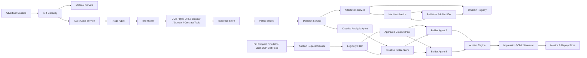

# Web3 广告审核、素材理解与竞价一体化 MVP 规格

## 1. 目标

本 MVP 旨在搭建一个面向 Web3 广告场景的一体化系统，解决以下问题：

- 广告主可以上传和配置待审核广告物料。
- 系统可以对图片广告中的网址、二维码、Telegram 链接、空投链接、钱包连接诱导等内容进行自动审核。
- 审核通过后，系统为广告生成链上可验证的审核证书。
- 系统新增一个 `Creative Analysis Agent`，对审核通过的物料做结构化分析，提取后续竞价可用的信息。
- `Bidder Agent` 只能在审核通过的素材池中选择广告，并基于素材画像和广告位请求进行出价。
- 广告位网页通过前端 SDK，在展示广告的同时展示“已审核”状态，并完成链上验证。

MVP 聚焦于从 `广告主提交图片素材` 到 `审核通过` 到 `素材画像生成` 到 `仿真竞价` 到 `广告位展示已审核证明` 的最短闭环。

## 2. 用户角色

- 广告主：上传广告物料、提交审核、查看结果、查看素材画像、管理 bidder agent、查看竞价表现。
- 审核系统运营方：维护审核策略、查看高风险案件、人工复核、签发证书。
- 平台策略研究员 / 投放优化人员：配置竞价实验、观察 agent 选材和出价行为、分析竞拍结果。
- 媒体方 / 广告位接入方：在网页中接入 SDK，展示广告并校验证书。
- 普通用户：在浏览器中查看广告，并点击“已审核”徽章查看证书详情。

## 3. MVP 范围

### 3.1 In Scope

- 仅支持图片类广告物料：`png/jpg/webp`
- 支持提取和审查：
  - 图片文字中的 URL
  - 图片文字中的 Telegram 链接
  - 图片中的二维码
  - 与空投 / claim / wallet connect / 官方背书相关的高风险文案
- 支持广告主 Console
- 支持自动审核 + 人工复核
- 支持通过后生成链上 Attestation
- 支持对审核通过的素材运行 `Creative Analysis Agent`
- 支持仿真竞价环境中的 `Bidder Agent`
- 支持一个广告主对应一个 bidder agent、一个 agent 对应一个策略
- 支持 bidder agent 在自己的 approved creatives 中选择素材、预测 CTR、输出 bid
- 支持广告位网页 SDK 做展示期校验

### 3.2 Out of Scope

- 视频广告审核
- 真实 DSP / ADX 线上 RTB 接入
- 多策略组合优化和复杂 bandit / RL 在线学习
- 多链同时部署
- 去中心化仲裁
- 收费结算与 billing

## 4. 核心产品形态

MVP 由 6 个核心部分组成：

- `Advertiser Console`：广告主配置素材、提交审核、查看素材画像、管理 bidder agent 的后台。
- `Audit Engine`：广告审核编排层，包含 triage agent、工具链、规则引擎和人工复核。
- `Creative Analysis Engine`：对审核通过素材进行结构化理解，生成 creative profile，供广告主和 bidder agent 使用。
- `Bidding Simulator`：接收广告位请求，调用多个 bidder agent 选择 approved creative 并出价，完成内部拍卖和结果回放。
- `Attestation Service`：审核通过后，将广告摘要写入链上并生成链下报告与 manifest。
- `Ad Verification SDK`：给广告位网页使用，在展示广告时校验证书并显示审核状态。

## 5. 总体架构



## 6. 核心业务闭环

### 6.1 广告主提交审核

1. 广告主登录 Console。
2. 创建一个广告条目，填写基本信息：
   - 广告名称
   - 品牌 / 项目名
   - 目标落地页 URL
   - Telegram 链接
   - 对应链和合约地址
   - 投放域名 / 投放媒体
3. 上传广告素材图片。
4. Console 为原始素材计算 `sha256`，生成 `creativeHash`。
5. 用户点击“提交审核”，系统创建 `audit_case`。

### 6.2 自动审核

1. `Triage Agent` 对图片和元数据做初筛。
2. Agent 提取实体：
   - OCR 文本
   - 图片中的 URL / 域名
   - Telegram 链接
   - 二维码内容
   - 文案中的风险词
   - 合约地址 / 钱包地址
3. Agent 输出 `tool plan`，决定调用哪些工具。
4. 工具执行后，把结果写入 `evidence store`。
5. `Policy Engine` 根据证据执行规则和风险打分。
6. 输出三种结果之一：
   - `PASS`
   - `REJECT`
   - `MANUAL_REVIEW`

### 6.3 审核通过后的素材理解

1. 若审核结果为 `PASS`，系统触发 `Creative Analysis Agent`。
2. Agent 基于已审核素材图片、审核摘要、声明信息和落地页信息生成 `creative profile`。
3. 该 profile 同时服务两类对象：
   - 广告主：理解素材卖点、适配受众、推荐广告位类型
   - bidder agent：在竞价时更快完成素材筛选、CTR 预估和出价
4. profile 写入 `creative_profile store`，并绑定 creative version。

### 6.4 仿真竞价

1. `Bid Request Simulator` 生成一个广告位请求。
2. `Eligibility Filter` 只保留满足以下条件的素材：
   - creative 状态为 `APPROVED`
   - 审核证书仍有效
   - 素材尺寸、格式、投放域名与当前广告位匹配
3. 每个 advertiser 的 `Bidder Agent` 获取：
   - 当前 `BidRequest`
   - 自己的 approved creative pool
   - 每个 creative 的 profile
   - 历史表现摘要
4. Bidder agent 在候选素材中选择 1 个 creative。
5. Bidder agent 预测该素材在当前请求下的 `pCTR`。
6. Bidder agent 按策略输出 `bid_cpm`。
7. `Auction Engine` 执行一价或二价拍卖，决定赢家。
8. 胜出素材进入展示和点击仿真。

### 6.5 展示验证

1. 广告位网页通过 SDK 拉取 `manifest`。
2. SDK 下载广告图片并本地计算 `creativeHash`。
3. SDK 对点击 URL 或目标 URL 计算 `destinationHash`。
4. SDK 调用验证 API 或直接读取链上 Attestation。
5. 如果证书有效且 hash 匹配，则在广告位展示“已审核”徽章。

### 6.6 反馈回路

1. `Impression / Click Simulator` 基于隐藏真实分布生成点击结果。
2. 系统记录：
   - 选中的 creative
   - 预测 CTR
   - 实际点击结果
   - bid 和 settlement price
3. 这些结果写入 metrics store。
4. 后续 bidder agent 可以使用这些历史结果做更好的素材选择和出价。

## 7. Agent 设计

MVP 建议采用 `3 类 agent + 多个确定性工具` 的结构，而不是把所有决策堆到一个 prompt 中。

### 7.1 Triage Agent

职责：

- 理解广告内容和上下文
- 从广告图片和元数据中抽取实体
- 根据实体生成工具调用计划
- 汇总工具证据并生成可读结论

不负责：

- 不直接决定最终放行
- 不直接替代规则引擎
- 不单独输出最终合规判定

最终判定由 `Policy Engine + Threshold + Human Review` 决定。

### 7.2 Creative Analysis Agent

职责：

- 仅对 `PASS` 的素材运行
- 提取素材的结构化营销信息
- 生成可复用的 `creative profile`
- 为广告主提供“这个素材适合投哪里、适合什么人、卖点是什么”的解释
- 为 bidder agent 提供“这个素材在什么请求下更值得选”的输入特征

不负责：

- 不重新做安全审核
- 不决定最终投放资格
- 不直接参加拍卖

### 7.3 Bidder Agent

职责：

- 只在自己的 approved creative pool 中选择素材
- 结合 `BidRequest + creative profile + 历史表现` 选择一个 creative
- 预测该素材在当前请求下的 `pCTR`
- 基于 `pCTR` 和策略参数输出 `bid_cpm`
- 提供结构化解释，方便回放

不负责：

- 不绕过审核使用未通过素材
- 不修改 creative 内容
- 不直接签发或撤销证书

### 7.4 Agent 之间的边界

- `Triage Agent` 负责回答：这个素材是否安全、是否能进入平台
- `Creative Analysis Agent` 负责回答：这个通过审核的素材有哪些营销和竞价可用特征
- `Bidder Agent` 负责回答：在这次广告位请求里，该选哪个 approved creative、该出多少钱

### 7.5 Triage Agent 输入

```json
{
  "creativeUrl": "https://cdn.example.com/ad.png",
  "creativeHash": "0xabc",
  "declaredLandingUrl": "https://brand.example/claim",
  "declaredTelegram": "https://t.me/brand",
  "contracts": ["0x1234"],
  "projectName": "Example",
  "chainId": 8453
}
```

### 7.6 Triage Agent 输出

```json
{
  "entities": {
    "urls": ["https://claim-example.xyz"],
    "telegramUrls": ["https://t.me/example_channel"],
    "qrPayloads": ["https://claim-example.xyz/?ref=qr"],
    "contracts": ["0x1234"],
    "riskTerms": ["airdrop", "claim now", "connect wallet"]
  },
  "toolPlan": [
    "decode_qr",
    "fetch_landing_page",
    "trace_redirects",
    "check_domain_reputation",
    "analyze_contract"
  ],
  "summary": "Image contains QR code, airdrop CTA, and wallet-connection language."
}
```

### 7.7 Creative Analysis Agent 输入

```json
{
  "creativeId": "cr_123",
  "creativeUrl": "https://cdn.example.com/ad.png",
  "creativeHash": "0xabc",
  "projectName": "Example",
  "declaredLandingUrl": "https://brand.example/claim",
  "auditSummary": "素材已通过审核，未发现显著安全风险。",
  "attestationId": "0xAttest123"
}
```

### 7.8 Creative Analysis Agent 输出

```json
{
  "creativeId": "cr_123",
  "marketingSummary": "强调空投领取和快速参与，CTA 较强，适合高兴趣 Web3 用户。",
  "visualTags": ["token-airdrop", "reward", "urgent-cta"],
  "copyStyle": "direct-response",
  "ctaType": "claim-now",
  "targetAudiences": ["existing-wallet-users", "web3-airdrop-hunters"],
  "placementFit": [
    { "slotType": "mobile-banner", "score": 0.76 },
    { "slotType": "desktop-rectangle", "score": 0.64 }
  ],
  "valueProps": ["free claim", "time limited", "official campaign"],
  "predictedCtrPriors": {
    "mobile-banner": 0.014,
    "desktop-rectangle": 0.009
  },
  "bidHints": {
    "recommendedStrategy": "moderately_aggressive",
    "suggestedMaxBidCpm": 28
  }
}
```

### 7.9 Bidder Agent 输入

```json
{
  "agentId": "ba_001",
  "advertiserId": "adv_001",
  "strategy": "growth",
  "bidRequest": {
    "slotId": "slot_123",
    "slotType": "mobile-banner",
    "size": "320x50",
    "floorCpm": 6,
    "siteCategory": "news",
    "userSegments": ["wallet-user", "airdrop-interested"],
    "hourOfDay": 20
  },
  "candidateCreatives": [
    {
      "creativeId": "cr_123",
      "profile": {
        "targetAudiences": ["existing-wallet-users", "web3-airdrop-hunters"],
        "placementFit": [{ "slotType": "mobile-banner", "score": 0.76 }],
        "predictedCtrPriors": { "mobile-banner": 0.014 }
      },
      "recentStats": {
        "impressions": 1200,
        "clicks": 19,
        "ctr": 0.0158
      }
    }
  ]
}
```

### 7.10 Bidder Agent 输出

```json
{
  "participate": true,
  "selectedCreativeId": "cr_123",
  "predictedCtr": 0.018,
  "bidCpm": 21.6,
  "confidence": 0.81,
  "reason": "该素材与当前用户兴趣和移动 banner 版位更匹配，CTA 强，历史 CTR 也较好。"
}
```

## 8. 工具链与特征服务设计

### 8.1 审核侧必备工具

- `OCR Tool`
  - 从图片中提取文本
  - 识别伪装域名和高风险文案

- `QR Decode Tool`
  - 解码图片中的二维码
  - 输出二维码 payload

- `URL Canonicalizer`
  - 标准化 URL
  - 拆出域名、路径、参数

- `Redirect Trace Tool`
  - 访问短链并抓取完整跳转链

- `Headless Browser Tool`
  - 抓取落地页 HTML、截图、最终 URL
  - 识别 wallet connect 按钮、授权引导、claim 入口

- `Domain Reputation Tool`
  - 检查域名年龄、证书、whois 风险信息

- `Telegram Link Checker`
  - 解析 `t.me` 链接基础信息
  - 判断是否与申报项目一致

- `Contract Analyzer`
  - 对广告中出现的合约地址做基础静态检查
  - 检查 owner、upgradeability、proxy、风险标签

### 8.2 素材理解侧服务

- `Creative Profiler`
  - 汇总图片视觉元素、文案、CTA、价值主张
  - 生成适合广告主阅读和 bidder 使用的 profile

- `Placement Mapper`
  - 把素材尺寸、文案风格、视觉密度映射到适合的广告位类型

- `Audience Tagger`
  - 根据素材表达内容生成候选受众标签

- `CTR Prior Builder`
  - 基于 profile 和已有历史表现生成初始 CTR prior

### 8.3 竞价侧输入服务

- `Bid Request Normalizer`
  - 标准化广告位、用户和上下文字段

- `Creative Eligibility Filter`
  - 过滤尺寸不匹配、证书失效、域名不允许的素材

- `Performance Stats Reader`
  - 读取 creative 和 agent 的历史曝光、点击、CTR

### 8.4 高风险触发条件

以下情况应自动提升风险级别：

- 图片包含二维码
- 宣传文案包含 `airdrop`、`claim`、`wallet connect`
- 使用短链
- 图片中的 URL 与声明落地页不一致
- Telegram 链接与项目名不匹配
- 域名注册时间过短
- 合约具备敏感 owner 权限

## 9. 规则引擎与素材准入设计

规则引擎仍是审核环节的最终裁决核心，建议采用结构化规则表而不是 prompt-only 判定。

### 9.1 审核输出结果

- `PASS`
- `REJECT`
- `MANUAL_REVIEW`

### 9.2 典型拒绝规则

- 图片二维码解码结果与申报落地页不一致
- 落地页存在诱导钱包授权且未申报
- 明显冒充已知品牌 / 协议
- 宣传文案出现虚假收益承诺
- 跳转链最终域名与图片宣称域名不一致

### 9.3 典型人工复核规则

- 域名较新但未发现直接恶意行为
- Telegram 群组信息不足
- 合约风险标签不明确
- 广告主申报信息缺失

### 9.4 竞价素材准入规则

只有满足以下条件的素材才能进入 bidder agent 的候选池：

- `creative.status = APPROVED`
- 对应 attestation 状态为 `ACTIVE`
- 对应 manifest 可用
- 对应 creative profile 已生成
- 当前广告位和素材尺寸 / 域名 / placement 规则匹配

### 9.5 版本与失效规则

- 广告主修改图片、click URL、landing URL 后必须重新审核
- 一旦 creative 版本变化，旧的 creative profile 立即失效
- attestation 过期或撤销后，该素材自动从竞价池移除

## 10. Bidder 与拍卖设计

### 10.1 MVP 抽象

MVP 采用以下抽象：

- `1 个广告主 = 1 个 bidder agent = 1 个策略`
- 每个 bidder agent 绑定一个广告主
- 每个 bidder agent 只能使用该广告主已审核通过的素材

后续可扩展到：

- 一个广告主对应多个 bidder agent
- 同一广告主的多策略对照实验
- 不同模型供应商混合竞价

### 10.2 一次竞价回合的步骤

1. 生成一个 `BidRequest`
2. 过滤每个 agent 的 eligible creatives
3. 每个 bidder agent 从自己的候选素材中选择一个 creative
4. 每个 bidder agent 输出 `predictedCtr`
5. 每个 bidder agent 基于策略输出 `bidCpm`
6. `Auction Engine` 结算赢家和 settlement price
7. 若需要，模拟 impression / click / conversion
8. 记录整个回合的解释信息和指标

### 10.3 推荐出价公式

MVP 阶段建议采用简单且可解释的公式：

```text
bid_cpm = predicted_ctr * value_per_click * 1000 * strategy_multiplier
```

其中：

- `predicted_ctr`：bidder agent 结合 bid request 与 creative profile 估计的点击率
- `value_per_click`：广告主对一次点击的主观价值
- `strategy_multiplier`：策略风格参数，例如增长型更高、保守型更低

### 10.4 为什么要先选素材再出价

同一个广告主可以有多张已审核通过的素材，而不同素材对不同广告位请求的表现可能差异很大。

因此 bidder agent 的真实决策顺序应是：

```text
先选 creative
-> 再估该 creative 的 pCTR
-> 再给出 bid
```

而不是先统一估一个 CTR，再事后随便挂一张图。

### 10.5 Auction Engine MVP 规则

MVP 可先支持两种模式：

- `first-price`
- `second-price`

默认建议先用 `second-price`，因为解释更直观，也更适合 demo 回放。

### 10.6 仿真输出指标

每个 agent 至少记录：

- `winRate`
- `avgBid`
- `avgSettlementPrice`
- `impressions`
- `clicks`
- `ctr`
- `selectedCreativeDistribution`
- `budgetSpend`
- `bidVolatility`

## 11. 广告主 Console MVP

Console 不再只是审核后台，还需要承担素材准备和竞价实验入口的角色。

### 11.1 页面结构

- `登录页`
- `Dashboard`
- `Creatives 列表页`
- `Create / Edit Creative 页`
- `Audit Cases 列表页`
- `Audit Case 详情页`
- `Creative Profile 详情页`
- `Bidder Agents 页`
- `Auctions / Simulation Runs 页`
- `Certificates 页`
- `Integration / Manifest 页`

### 11.2 Dashboard

展示广告主当前的核心状态：

- 待审核素材数量
- 审核通过数量
- 被拒绝数量
- 已生成素材画像数量
- 可进入竞价池的素材数量
- 最近 7 天竞价记录

### 11.3 Create / Edit Creative 页

广告主在此页面配置待审核物料。

表单字段建议如下：

- `creativeName`
- `projectName`
- `brandLogo`（可选）
- `landingUrl`
- `telegramUrl`（可选）
- `chainId`（可选）
- `contractAddress`（可选）
- `placementDomains`
- `imageFile`
- `clickUrl`
- `notes`（可选）

页面交互应包括：

- 图片上传后即时预览
- 本地 OCR 预览或服务端 OCR 预览
- 自动检测图片中的 URL / 二维码并高亮提示
- 显示“声明目标 URL”和“检测到的目标 URL”对比
- 一键提交审核

### 11.4 Audit Case 详情页

展示一个审核案件的全流程信息：

- 基础素材信息
- OCR 结果
- 二维码解码结果
- 跳转链
- 风险信号
- 审核结论
- 规则命中项
- 人工复核意见
- 证书状态

### 11.5 Creative Profile 详情页

这是新增页面，用于帮助广告主理解“审核通过后，这张图适合怎么投”。

建议展示：

- `marketingSummary`
- `visualTags`
- `ctaType`
- `copyStyle`
- `targetAudiences`
- `placementFit`
- `predictedCtrPriors`
- `bidHints`
- 最近表现摘要

### 11.6 Bidder Agents 页

广告主可以查看：

- 当前绑定的 bidder agent
- agent 策略说明
- 当前可投放素材数量
- 默认 `valuePerClick`
- 最近 7 天竞价表现

### 11.7 Auctions / Simulation Runs 页

用于回放和分析竞价过程。

建议展示：

- 请求概览
- 参与 agent
- 每个 agent 选中的 creative
- predicted CTR
- bid 和 settlement price
- 胜出者
- impression / click 结果
- agent 的解释文本

### 11.8 Certificates 页

广告主可以查看：

- 证书状态：有效 / 过期 / 撤销
- attestation ID
- 链上网络
- 签发时间
- 到期时间
- manifest 下载链接

### 11.9 Integration / Manifest 页

此页面给广告主或媒体方使用，提供 SDK 接入所需信息：

- `manifest URL`
- `attestationId`
- `creativeId`
- `verification status`
- 示例嵌入代码

### 11.10 广告主关键操作流

#### 路径 A：创建素材并提交审核

1. 新建 creative
2. 填写 `landingUrl / clickUrl / telegramUrl`
3. 上传图片
4. 系统预检查：
   - 图片 hash
   - OCR 预览
   - 二维码结果
   - 声明 URL 与检测 URL 对比
5. 点击提交审核
6. 跳转到 `Audit Case Detail`

#### 路径 B：查看审核结果和素材画像

1. 打开 `Audit Case Detail`
2. 查看风险摘要和具体证据
3. 若通过审核，进入 `Creative Profile Detail`
4. 查看：
   - 素材卖点
   - 推荐受众
   - 推荐 placement
   - CTR prior 和 bid hints

#### 路径 C：查看竞价表现

1. 打开 `Auctions / Simulation Runs`
2. 查看该 agent 参与过的拍卖回合
3. 对比：
   - 选中的 creative
   - predicted CTR
   - bid
   - 是否胜出
   - 是否点击

#### 路径 D：获取投放接入信息

1. 审核通过后进入 `Certificates`
2. 查看 attestation 状态
3. 打开 `Integration / Manifest`
4. 复制：
   - `manifestUrl`
   - `attestationId`
   - SDK 示例代码

#### 路径 E：重新提交

适用于以下场景：

- 素材改图
- click URL 变更
- 证书过期
- 审核被拒后修改再提审

重新提交时应创建新版本的 creative，并继承前一版本基础信息，避免广告主重复填写全部字段。

## 12. 审核员后台 MVP

运营方需要一个最小复核界面。

### 12.1 列表能力

- 按风险等级筛选
- 查看 `MANUAL_REVIEW` 队列
- 查看即将过期证书
- 查看待生成 / 生成失败的 creative profile

### 12.2 详情能力

- 查看工具证据
- 查看广告主提交信息
- 填写复核意见
- 执行 `approve / reject / revoke`
- 手动重跑 `Creative Analysis Agent`

## 13. SDK 设计

SDK 面向广告位网页使用，用来加载广告、验证证书并展示徽章。

### 13.1 SDK 目标

- 低接入成本
- 默认不影响广告位加载
- 能给终端用户展示可点击的审核状态
- 能校验“当前看到的广告”是否就是审核通过的那一份

### 13.2 SDK MVP 能力

- 拉取广告 manifest
- 拉取广告素材
- 本地计算素材 hash
- 校验点击目标 hash
- 查询证书有效性
- 显示徽章和详情弹层
- 暴露回调事件给媒体方

### 13.3 推荐集成方式

```html
<div id="zkdsp-ad-slot"></div>
<script src="https://cdn.example.com/zkdsp-ad-sdk.min.js"></script>
<script>
  ZKDSPAdSDK.mount({
    container: "#zkdsp-ad-slot",
    manifestUrl: "https://api.example.com/manifests/mf_123",
    verifyMode: "api-first",
    badgePosition: "top-right",
    onVerified: function (result) {
      console.log("verified", result);
    },
    onMismatch: function (result) {
      console.warn("mismatch", result);
    }
  });
</script>
```

### 13.4 SDK 配置项

- `container`
- `manifestUrl`
- `verifyMode`
  - `api-first`
  - `onchain-direct`
- `badgePosition`
- `theme`
- `failMode`
  - `open`
  - `closed`
- `onReady`
- `onVerified`
- `onExpired`
- `onRevoked`
- `onMismatch`

### 13.5 SDK 返回状态

- `verified`
- `expired`
- `revoked`
- `mismatch_creative`
- `mismatch_destination`
- `unreachable`
- `unknown`

### 13.6 SDK UI

广告位本体之外，SDK 负责渲染一个小型审核徽章：

- 文案示例：
  - `已审核`
  - `审核过期`
  - `证书已撤销`
  - `未验证`

用户点击徽章后打开详情层，内容包括：

- 项目名
- 签发机构
- 签发时间
- 到期时间
- 当前素材是否匹配
- 当前跳转目标是否匹配
- 查看链上证明
- 查看审核报告摘要

### 13.7 SDK 运行时校验流程

```text
1. 拉取 manifest
2. 下载 creativeUrl
3. 计算 creativeHash
4. 标准化 clickUrl 或 declaredLandingUrl
5. 计算 destinationHash
6. 发起 verify
7. 根据结果渲染广告和徽章
8. 上报 verification event
```

建议区分两个 hash：

- `creativeHash`
- `destinationHash`

### 13.8 SDK 验证伪代码

```ts
async function verifyAdSlot(manifestUrl: string) {
  const manifest = await fetchManifest(manifestUrl);
  const creativeBytes = await fetchBinary(manifest.creativeUrl);
  const creativeHash = sha256(creativeBytes);

  const normalizedDestination = canonicalizeUrl(
    manifest.clickUrl || manifest.declaredLandingUrl
  );
  const destinationHash = sha256(normalizedDestination);

  const result = await verify({
    attestationId: manifest.attestationId,
    creativeHash,
    destinationHash,
    hostname: location.hostname
  });

  return {
    manifest,
    result
  };
}
```

### 13.9 SDK 事件上报

- `manifest_loaded`
- `creative_loaded`
- `verification_succeeded`
- `verification_failed`
- `verification_mismatch_creative`
- `verification_mismatch_destination`
- `badge_clicked`

## 14. Manifest 设计

广告位侧不应直接只拿一张图片，而应获取一个 manifest。

### 14.1 Manifest 字段

```json
{
  "manifestId": "mf_123",
  "creativeId": "cr_123",
  "adId": "ad_001",
  "projectName": "Example",
  "creativeUrl": "https://cdn.example.com/creative.png",
  "clickUrl": "https://jump.example.com/abc",
  "declaredLandingUrl": "https://brand.example/claim",
  "chainId": 8453,
  "registryAddress": "0xRegistry",
  "attestationId": "0xAttest123",
  "creativeHash": "0xCreativeHash",
  "destinationHash": "0xDestinationHash",
  "policyVersion": "v1.0",
  "issuedAt": 1776200000,
  "expiresAt": 1776286400,
  "issuer": "0xIssuer",
  "reportUrl": "https://api.example.com/reports/rp_123/public"
}
```

### 14.2 Manifest 设计原则

- 便于广告位快速读取
- 只暴露展示侧需要的最小信息
- 不暴露敏感内部证据
- 可以由 CDN 缓存，但需要短 TTL

## 15. 链上 Attestation 设计

MVP 不建议把整份审核报告写链上，只存摘要和状态。

### 15.1 Attestation 结构

```solidity
struct AdAttestation {
    bytes32 attestationId;
    bytes32 creativeHash;
    bytes32 destinationHash;
    bytes32 placementDomainHash;
    bytes32 policyVersionHash;
    uint256 issuedAt;
    uint256 expiresAt;
    address issuer;
    uint8 status;
    string reportCID;
}
```

### 15.2 状态定义

- `0 = Unknown`
- `1 = Active`
- `2 = Revoked`
- `3 = Expired`

### 15.3 合约最小接口

```solidity
function issueAttestation(
    bytes32 attestationId,
    bytes32 creativeHash,
    bytes32 destinationHash,
    bytes32 placementDomainHash,
    bytes32 policyVersionHash,
    uint256 expiresAt,
    string calldata reportCID
) external;

function revokeAttestation(bytes32 attestationId, string calldata reason) external;

function getAttestation(bytes32 attestationId) external view returns (AdAttestation memory);
```

### 15.4 为什么要绑定 placementDomain

如果不绑定投放域名，广告主可能把“审核通过”的同一张图跨站复用到不受控场景，削弱证书价值。

MVP 可以先支持两种模式：

- 绑定单个域名
- 不绑定域名但标记为 `generic`

## 16. 验证模式设计

### 16.1 API First

流程：

1. SDK 请求验证 API
2. API 查链上状态
3. API 返回结构化验证结果

优点：

- 实现快
- 首屏更稳
- 兼容所有网页环境

缺点：

- 用户需要信任平台 API

### 16.2 Onchain Direct

流程：

1. SDK 本地连接只读 RPC
2. SDK 直接读取链上 Attestation
3. SDK 本地比对 hash

优点：

- 更接近 trustless

缺点：

- 前端复杂度更高
- 首次加载更慢

MVP 建议默认 `api-first`，并预留 `onchain-direct`。

## 17. 数据模型

### 17.1 advertisers

- `id`
- `name`
- `walletAddress`
- `contactEmail`
- `createdAt`

### 17.2 creatives

- `id`
- `advertiserId`
- `creativeName`
- `projectName`
- `imageUrl`
- `creativeHash`
- `landingUrl`
- `telegramUrl`
- `clickUrl`
- `chainId`
- `contractAddress`
- `status`
- `createdAt`

### 17.3 audit_cases

- `id`
- `creativeId`
- `status`
- `riskScore`
- `decision`
- `policyVersion`
- `submittedAt`
- `completedAt`

### 17.4 audit_evidences

- `id`
- `auditCaseId`
- `toolName`
- `payload`
- `createdAt`

### 17.5 creative_profiles

- `id`
- `creativeId`
- `auditCaseId`
- `analysisVersion`
- `marketingSummary`
- `visualTags`
- `ctaType`
- `copyStyle`
- `targetAudiences`
- `placementFit`
- `predictedCtrPriors`
- `bidHints`
- `createdAt`
- `updatedAt`

### 17.6 bidder_agents

- `id`
- `advertiserId`
- `name`
- `strategyPrompt`
- `apiKeyRef`
- `valuePerClick`
- `status`
- `createdAt`

### 17.7 auction_requests

- `id`
- `slotId`
- `slotType`
- `size`
- `floorCpm`
- `siteCategory`
- `userFeatures`
- `context`
- `createdAt`

### 17.8 auction_bids

- `id`
- `auctionRequestId`
- `bidderAgentId`
- `selectedCreativeId`
- `predictedCtr`
- `bidCpm`
- `confidence`
- `reason`
- `createdAt`

### 17.9 auction_results

- `id`
- `auctionRequestId`
- `winnerBidId`
- `settlementPrice`
- `shownCreativeId`
- `clicked`
- `createdAt`

### 17.10 attestations

- `id`
- `auditCaseId`
- `attestationId`
- `chainId`
- `txHash`
- `status`
- `reportCID`
- `issuedAt`
- `expiresAt`

### 17.11 manifests

- `id`
- `creativeId`
- `attestationId`
- `manifestJson`
- `version`
- `createdAt`

## 18. API 设计

### 18.1 广告主 Console API

- `POST /api/creatives`
- `GET /api/creatives`
- `GET /api/creatives/:id`
- `POST /api/creatives/:id/submit-audit`
- `GET /api/audit-cases`
- `GET /api/audit-cases/:id`
- `GET /api/creative-profiles/:creativeId`
- `GET /api/bidder-agents`
- `POST /api/bidder-agents`
- `GET /api/auction-requests/:id`
- `GET /api/auction-results/:id`
- `POST /api/simulation-runs`
- `GET /api/certificates`
- `GET /api/manifests/:id`

### 18.2 审核与素材理解内部 API

- `POST /internal/audit-cases/:id/triage`
- `POST /internal/audit-cases/:id/run-tools`
- `POST /internal/audit-cases/:id/evaluate`
- `POST /internal/audit-cases/:id/issue-attestation`
- `POST /internal/creatives/:id/analyze`

### 18.3 竞价内部 API

- `POST /internal/auction-requests`
- `POST /internal/auction-requests/:id/run`
- `POST /internal/bidder-agents/:id/bid`
- `POST /internal/auction-results/:id/simulate-click`

### 18.4 SDK 验证 API

- `POST /api/sdk/verify`

请求：

```json
{
  "attestationId": "0xAttest123",
  "creativeHash": "0xCreativeHash",
  "destinationHash": "0xDestinationHash",
  "hostname": "publisher.example"
}
```

响应：

```json
{
  "status": "verified",
  "attestationStatus": "active",
  "creativeMatched": true,
  "destinationMatched": true,
  "domainMatched": true,
  "issuedAt": 1776200000,
  "expiresAt": 1776286400,
  "explorerUrl": "https://basescan.org/tx/0x123"
}
```

## 19. 前端页面信息架构建议

### 19.1 广告主 Console

- `/login`
- `/dashboard`
- `/creatives`
- `/creatives/new`
- `/creatives/:id`
- `/audit-cases`
- `/audit-cases/:id`
- `/creative-profiles/:creativeId`
- `/bidder-agents`
- `/auctions`
- `/auctions/:id`
- `/certificates`
- `/integrations`

### 19.2 审核员后台

- `/ops/review-queue`
- `/ops/audit-cases/:id`
- `/ops/policies`
- `/ops/certificates`
- `/ops/creative-profiles/:creativeId`

## 20. 推荐技术栈

为了让 MVP 尽快落地，建议技术栈保持简单：

- 前端 Console：`Next.js`
- 后端 API：`Go` 或 `Next.js Route Handlers`
- 数据库：`PostgreSQL`
- 缓存 / 队列：`Redis`
- 对象存储：`S3 / R2`
- OCR / Vision：多模态模型 + OCR 服务
- 浏览器抓取：`Playwright`
- 链上交互：`viem` 或 `go-ethereum`
- 合约：`Solidity`
- 部署链：先选一条低成本 EVM 链
- Agent 模型：`Claude`

## 21. MVP 开发阶段

### Phase 1: Console + 基础审核

- 广告主上传图片
- 基础字段配置
- 创建审核案件
- OCR / QR / URL 提取
- 人工复核页

### Phase 2: 自动判定 + 证书

- 引入 Triage Agent
- 接通规则引擎
- 通过后签发链上 Attestation
- 生成 manifest

### Phase 3: Creative Analysis Agent

- 对 `PASS` 的素材自动生成 creative profile
- 在 Console 展示素材画像
- 建立 bidder 可消费的 profile store

### Phase 4: Bidding Simulator

- 新增 bidder_agents
- 新增 auction_requests / bids / results
- bidder agent 基于 approved creatives 选择素材并出价
- 支持回放和点击仿真

### Phase 5: SDK + 展示侧验证

- 发布浏览器 SDK
- 广告位加载 manifest
- 展示审核徽章
- 支持 API-first 验证

## 22. MVP 成功标准

- 广告主可以在 5 分钟内完成一次广告提交
- 系统可自动识别图片中的 URL 和二维码
- 审核通过的广告可生成链上证书
- 审核通过的素材可自动生成结构化素材画像
- bidder agent 可以只从 approved creative pool 中选图
- bidder agent 可以输出 `selectedCreativeId + predictedCtr + bidCpm`
- 仿真竞价结果可回放，能解释 agent 为什么选了某个 creative
- 网页广告位能够正确显示“已审核”状态
- 当前展示素材被替换时，SDK 能检测到 mismatch

## 23. 风险与防滥用

### 23.1 需要重点防的攻击或失败模式

- 广告主拿旧证书复用到新素材
- 图片不变但 click URL 被替换
- 使用短链隐藏最终落地页
- 图片里显示安全域名，二维码跳到恶意域名
- 审核通过后落地页内容发生变化
- bidder agent 试图使用未审核或已过期素材
- creative profile 因素材更新而过期
- bidder agent 因 hallucination 给出离谱高价

### 23.2 MVP 缓解方式

- 强绑定 `creativeHash`
- 强绑定 `destinationHash`
- 证书必须设置 `expiresAt`
- 支持证书撤销
- 对跳转链取最终目标做摘要
- 竞价前强制走 eligibility filter
- creative 更新后自动重跑审核与 profile 生成
- 对 bidder 设置 `maxBidCpm` 和异常回退逻辑

## 24. 首版非功能要求

- 审核任务异步化
- creative analysis 任务异步化
- 单个案件证据可审计
- 单次拍卖过程可回放
- bidder 输出必须结构化
- SDK 初始化不阻塞页面主流程
- Manifest 和报告接口有访问控制
- 链上写入失败时，案件状态不可误标为已签发

## 25. 建议的首个演示场景

用于 Demo 的最小链路建议如下：

1. 广告主 A 在 Console 上传两张图片素材并提交审核。
2. 广告主 B 在 Console 上传两张图片素材并提交审核。
3. 审核引擎提取二维码内容和 OCR 文本，并完成审核。
4. 通过审核的素材自动生成 attestation 和 creative profile。
5. 平台生成一个 mock `BidRequest`。
6. Agent A 和 Agent B 分别从自己的 approved creatives 中选择 1 个素材。
7. 两个 bidder agent 分别输出：
   - `selectedCreativeId`
   - `predictedCtr`
   - `bidCpm`
   - `reason`
8. Auction Engine 选择赢家并模拟点击。
9. Console 展示本轮回放，广告主能看到 agent 为什么选了那张图、为什么出了这个价。
10. 若需要展示侧验证，则由 SDK 加载胜出的 manifest 并展示 `已审核` 徽章。

## 26. 下一步建议

如果进入实现阶段，建议按下面顺序开工：

1. 先复用现有审核系统，把 `APPROVED -> attestation -> manifest` 这条链稳定下来
2. 新增 `creative_profiles`，把审核通过素材自动转成结构化画像
3. 新增 `bidder_agents` 与竞价相关表
4. 先做一个 mock `BidRequest` 生成器
5. 实现 bidder agent 的固定输入输出协议
6. 做最小版拍卖器和回放页
